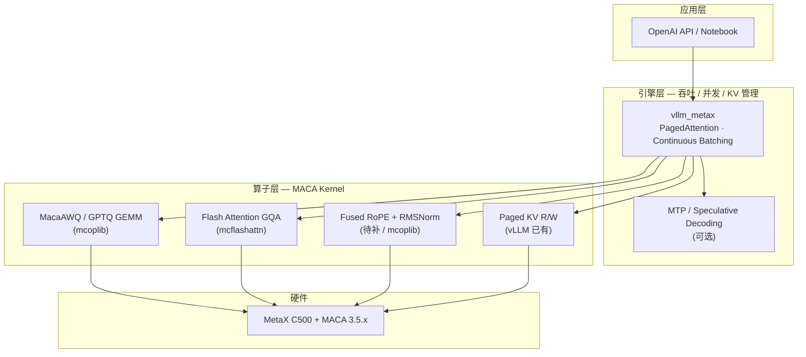

# AGENT.md — 沐曦显卡 Unsloth + Qwen3.6 推理测试

> 本文档记录 `metaX-inference` 仓库中，在沐曦显卡上使用 Unsloth 运行 Qwen3.6 推理的测试方案、执行步骤与验收标准。

## 1. 测试目标

验证在沐曦 GPU 上通过以下两条路径完成 Qwen3.6 推理：

| 方案 | 路径 | 适用场景 |
|------|------|----------|
| **A** | Unsloth GGUF + llama.cpp (Vulkan) | 快速验证、本地调试 |
| **B** | Unsloth 量化 + 沐曦 MacaRT-vLLM | 生产部署、高吞吐 |

## 2. 硬件与软件前提

### 2.1 硬件

- **显卡**：曦云 C 系列 / 曦思系列
- **显存建议**：
  - Qwen3.6-7B / 14B：< 24GB
  - Qwen3.6-27B：≥ 18GB（推荐 ≥ 24GB）
  - Qwen3.6-35B-A3B (MoE)：≥ 22GB（推荐 ≥ 32GB）

### 2.2 软件栈

- **MXMACA**：v3.3.0+（PyTorch 兼容 + Vulkan 驱动）
- **系统**：Linux（Ubuntu 20.04 / 22.04），Windows 需 WSL2
- **Python**：3.10（推荐）
- **Vulkan SDK**：llama.cpp Vulkan 后端必需

### 2.3 环境安装

```bash
# 沐曦驱动与基础库
sudo apt install metax-maca-driver metax-maca-runtime metax-maca-dev

# Vulkan SDK
wget -qO- https://packages.lunarg.com/lunarg-signing-key-pub.asc | sudo apt-key add -
sudo wget -qO /etc/apt/sources.list.d/lunarg-vulkan-1.3.280-jammy.list \
  https://packages.lunarg.com/vulkan/1.3.280/lunarg-vulkan-1.3.280-jammy.list
sudo apt update && sudo apt install vulkan-sdk

# Python 环境
conda create -n unsloth-meta python=3.10 -y
conda activate unsloth-meta
pip install unsloth torch==2.2.0+cpu --index-url https://download.pytorch.org/whl/cpu
pip install transformers accelerate sentencepiece
```

## 3. 测试前检查

在沐曦机器上运行仓库内环境检查脚本：

```bash
./scripts/test-env-check.sh
```

### 3.1 检查项与通过标准

| 编号 | 检查项 | 命令 / 方法 | 通过标准 |
|------|--------|-------------|----------|
| E01 | MXMACA 驱动 | `dpkg -l \| grep metax-maca` | 已安装 driver / runtime / dev |
| E02 | Vulkan 设备 | `vulkaninfo \| grep -i device` | 能识别沐曦 GPU |
| E03 | Python 环境 | `python --version` | 3.10.x |
| E04 | Unsloth 可用 | `python -c "import unsloth"` | 无 ImportError |
| E05 | 显存容量 | 系统工具 / `mx-smi` | 满足所选模型下限 |

## 4. 方案 A 测试：Unsloth GGUF + llama.cpp (Vulkan)

### 4.1 原理

Unsloth 提供 Qwen3.6 的 **MTP 优化 GGUF 量化模型**；llama.cpp 通过 Vulkan 后端调用沐曦 GPU 加速，无需额外适配层。

### 4.2 测试步骤

```bash
# 1. 下载模型（Q4_K_M 量化，速度与精度平衡）
git clone https://huggingface.co/unsloth/Qwen3.6-27B-MTP-GGUF
cd Qwen3.6-27B-MTP-GGUF
wget https://huggingface.co/unsloth/Qwen3.6-27B-MTP-GGUF/resolve/main/qwen3.6-27b-mtp-q4_k_m.gguf

# 2. 编译 llama.cpp（启用 Vulkan）
git clone https://github.com/ggerganov/llama.cpp
cd llama.cpp && mkdir build && cd build
cmake -DGGML_VULKAN=ON ..
make -j$(nproc)

# 3. 启动推理服务
./llama-server \
  -m ../../Qwen3.6-27B-MTP-GGUF/qwen3.6-27b-mtp-q4_k_m.gguf \
  -ngl 99 \
  -c 8192 \
  --spec-type mtp --spec-draft-n-max 3

# 4. 功能验证
curl http://localhost:8080/completion \
  -d '{"prompt":"你好，我是","n_predict":128}'
```

也可使用仓库脚本（需先设置 `GGUF_MODEL` 与 `LLAMA_SERVER` 环境变量）：

```bash
export GGUF_MODEL=/path/to/qwen3.6-27b-mtp-q4_k_m.gguf
export LLAMA_SERVER=/path/to/llama.cpp/build/bin/llama-server
./scripts/test-scheme-a.sh
```

### 4.3 验收标准

| 编号 | 测试项 | 预期结果 |
|------|--------|----------|
| A01 | 服务启动 | `llama-server` 无 Vulkan 初始化错误 |
| A02 | GPU 卸载 | 日志显示 GPU 层已加载（`-ngl 99`） |
| A03 | 补全接口 | `curl` 返回合法 JSON，`content` 含中文续写 |
| A04 | MTP 加速 | 启用 `--spec-type mtp` 后 tokens/s 高于未启用（约 1.5–2×） |
| A05 | 上下文窗口 | `-c 8192` 下长 prompt 不 OOM |

### 4.4 关键参数

- `-ngl 99`：尽可能多地将层卸载到 GPU
- `-c 8192`：上下文长度
- `--spec-type mtp --spec-draft-n-max 3`：MTP 推测解码加速

## 5. 方案 B 测试：Unsloth 量化 + MacaRT-vLLM

### 5.1 原理

Unsloth 对 Qwen3.6 做 4-bit 量化后，由沐曦适配的 **MacaRT-vLLM**（vLLM 后端插件）提供更高吞吐与更低延迟。

### 5.2 测试步骤

```bash
# 1. 安装 MacaRT-vLLM
pip install macart-vllm-metax==0.11.0

# 2. Unsloth 量化并导出（见 scripts/quantize-qwen36.py）
python scripts/quantize-qwen36.py \
  --model Qwen/Qwen3.6-27B \
  --output ./qwen3.6-27b-4bit

# 3. 启动 vLLM API 服务
python -m vllm.entrypoints.api_server \
  --model ./qwen3.6-27b-4bit \
  --tensor-parallel-size 1 \
  --max-model-len 8192 \
  --dtype auto \
  --trust-remote-code

# 4. 功能验证
curl http://localhost:8000/v1/completions \
  -H "Content-Type: application/json" \
  -d '{"model":"qwen3.6-27b-4bit","prompt":"你好，我是","max_tokens":128}'
```

或使用脚本：

```bash
export VLLM_MODEL=./qwen3.6-27b-4bit
./scripts/test-scheme-b.sh
```

### 5.3 验收标准

| 编号 | 测试项 | 预期结果 |
|------|--------|----------|
| B01 | 量化导出 | `save_pretrained_merged` 生成 safetensors 与 tokenizer |
| B02 | vLLM 启动 | API server 监听 8000，日志显示 GPU 被使用 |
| B03 | 补全接口 | OpenAI 兼容 `/v1/completions` 返回正常文本 |
| B04 | 吞吐 | 批量请求下 tokens/s 优于方案 A（同硬件同模型） |
| B05 | 显存 | 4-bit 27B 在 ≥18GB 显存下可稳定运行 |

## 6. 模型与量化选型

### 6.1 按显存选模型

| 显存 | 推荐模型 | 量化档位 |
|------|----------|----------|
| 8–16GB | Qwen3.6-7B | Q4_K_M / Unsloth Dynamic 2.0 |
| 16–24GB | Qwen3.6-14B | Q4_K_M |
| 24–32GB | Qwen3.6-27B | Q4_K_M（方案 A）/ 4-bit（方案 B） |
| ≥32GB | Qwen3.6-35B-A3B | Q4_K_M 或 Q6_K_XL |

### 6.2 量化策略

- **Q4_K_M**：速度与精度平衡（方案 A 默认）
- **Q6_K_XL**：更高精度，显存占用更大
- **Unsloth Dynamic 2.0**：极致压缩，适合显存紧张
- **4-bit（方案 B）**：配合 vLLM 生产部署

## 7. 性能优化与注意事项

1. **关闭显存压缩**，确保 MXMACA 后端正常加载。
2. **MTP**：方案 A 务必启用 `--spec-type mtp`。
3. **Unsloth 训练**：目前仅支持 NVIDIA；**推理**可通过 Vulkan / 沐曦后端完成。
4. **显存不足**：降低量化（如 Q2_K），或 llama.cpp 使用 `--cpu-moe` 做 CPU+GPU 混合。

## 8. 常见问题

| 现象 | 排查 | 处理 |
|------|------|------|
| Vulkan 初始化失败 | `vulkaninfo` | 重装 MXMACA 驱动与 Vulkan SDK |
| 显存 OOM | 降低 `-ngl` 或换更小量化 | Q2_K / 更小模型 |
| 推理慢 | 检查 `-ngl`、GPU 利用率 | 确保层在 GPU 上 |
| vLLM 无法加载沐曦 | 日志与 `macart-vllm-metax` 版本 | 使用 `==0.11.0` 并与 MXMACA 版本匹配 |

## 9. 测试结果

**实机测试记录见 [TEST_RESULTS.md](./TEST_RESULTS.md)**（MetaX C500 / 32GB / 2026-07-06）。

### 实机验证摘要

| 方案 | 状态 | 说明 |
|------|------|------|
| A（GGUF） | **PASS（CPU）** | `Qwen3.6-27B-Q4_K_M.gguf` + llama-server；GPU Vulkan 未启用 |
| B（vLLM） | **PASS** | `QuantTrio/Qwen3.6-27B-AWQ` + vllm_metax 0.17.0，~9.5 tok/s |

### Qwen3.6 特别注意

`Qwen3.6` 在 `config.json` 中声明 `model_type: qwen3_5`，**transformers 4.57.x 无法加载**。实机需：

```bash
pip install "git+https://github.com/huggingface/transformers.git"
```

### 32GB 显存（MetaX C500 sGPU）推荐

- **模型**：`QuantTrio/Qwen3.6-27B-AWQ`（INT4，推理占用约 28GB）
- **参数**：`--max-model-len 8192`，`--tensor-parallel-size 1`
- **备选**：`Qwen/Qwen3.6-35B-A3B`（MoE，需单独实测）

### 结果记录模板

在沐曦实机上执行后，可将结果追加到 [TEST_RESULTS.md](./TEST_RESULTS.md)：

```markdown
## 测试执行记录

- **日期**：
- **机器**：显卡型号 / 显存 / MXMACA 版本 / OS
- **执行人**：

### 环境检查 (E01–E05)

| 编号 | 结果 | 备注 |
|------|------|------|
| E01  | PASS/FAIL | |
| ...  | | |

### 方案 A (A01–A05)

| 编号 | 结果 | tokens/s | 备注 |
|------|------|----------|------|
| A01  | | | |
| ...  | | | |

### 方案 B (B01–B05)

| 编号 | 结果 | tokens/s | 备注 |
|------|------|----------|------|
| B01  | | | |
| ...  | | | |

### 结论

- [ ] 方案 A 可用于快速验证
- [ ] 方案 B 可用于生产部署
- **阻塞问题**：
```

## 10. 仓库脚本索引

| 脚本 | 用途 |
|------|------|
| `scripts/test-env-check.sh` | 测试前环境检查 (E01–E05) |
| `scripts/test-scheme-a.sh` | 方案 A 自动化冒烟测试 |
| `scripts/test-scheme-b.sh` | 方案 B 自动化冒烟测试 |
| `scripts/quantize-qwen36.py` | Unsloth 4-bit 量化并导出 |
| `scripts/remote_test_scheme_b.sh` | 实机方案 B 端到端测试（含模型下载） |
| `scripts/remote_test_scheme_a.sh` | 实机方案 A 端到端测试（GGUF + llama-server） |
| `scripts/remote_test_vllm_fix.sh` | 升级 transformers 后启动 vLLM 并验证 |
| `scripts/bench_qwen36.py` | Qwen3.6 端到端 tok/s 基准（Phase 1+） |
| `scripts/run_phase1_bench.sh` | Phase 1 vLLM 参数扫描 |
| `scripts/run_phase1_concurrent_bench.sh` | Phase 1 并发 batch 基准（1/4/8 req） |
| `scripts/run_phase3_mtp_bench.sh` | Phase 3 MTP / ngram speculative 基准 |
| `scripts/run_op_bench.sh` | 算子级 micro-benchmark |
| `scripts/profile_decode.py` | PyTorch profiler decode 热点分析 |
| `scripts/remote_sync_repo.sh` | tarball 同步仓库到实机 |
| `scripts/check_mtp_head.py` | 检测 checkpoint 是否含 MTP head 权重 |
| `scripts/parse_bench_results.py` | 解析实机基准日志为 Markdown |
| `scripts/remote_run_all_benches.sh` | 一键跑 Phase 1/2/3 全套基准 |
| `metax_kernels/bench/op_bench.py` | fused RoPE / GQA attention 基准 |
| `configs/qwen36-27b-awq.yaml` | C500 32GB 推荐 vLLM 配置 |

## 11. 总结

- **快速验证**：方案 A（GGUF + llama.cpp；沐曦 Vulkan 未打通时用 CPU 回退）。
- **生产部署**：**方案 B**（vLLM + vllm_metax）— 实机已 PASS，~9.5 tok/s。
- **长期最优**：见第 12 节 — 在 vllm_metax + mcoplib 上构建 MACA 版「算子 + 引擎」双层加速，而非移植 Unsloth Triton/CUDA。

---

## 12. MACA 最佳推理工具设计（对标 Unsloth 双层加速）

> **Design 阶段** — 目标：在沐曦 MACA 上为 Qwen3.6-27B 构建类似 Unsloth 的推理加速栈，但**不能**直接复用 Unsloth 的 Triton/CUDA 内核。

### 12.1 为什么 Unsloth 不能直接搬过来？

| Unsloth 组件 | 依赖 | MACA 现状 |
|--------------|------|-----------|
| FastInference / Triton 内核 | NVIDIA CUDA + Triton | **不可用**（MACA 非 CUDA ISA） |
| RoPE / KV 融合算子 | 自定义 CUDA | 需用 **mcoplib / mcflashattn / MACA DSL** 重写 |
| `for_inference()` patch | PyTorch + CUDA autograd | 可借鉴思路，底层算子必须换 MACA |
| vLLM 导出 | 通用 vLLM | **已有** `vllm_metax 0.17.0` + `mcoplib`（实机 PASS） |

实机结论：**Unsloth 的价值在「架构分层 + 热点算子融合」**；在 MACA 上应把「热点算子」映射到沐曦栈，把「吞吐引擎」交给 **vllm_metax**。

### 12.2 目标架构（对标 Unsloth 双层模型）



对应 Unsloth 映射关系：

| Unsloth 能力 | MACA 等价实现 | 优先级 |
|--------------|---------------|--------|
| vLLM + PagedAttention | **vllm_metax**（已部署） | P0 ✅ |
| AWQ / 4bit 量化推理 | **MacaAWQMarlinConfig**（vllm_metax 已注册） | P0 ✅ |
| Flash Attention | **mcflashattn** + vLLM attention backend | P0 |
| Fused RoPE | **mcoplib 自定义 Op** 或 vllm_metax fused pass | P1 |
| KV Cache 优化 | vLLM v1 KV manager（已用） | P0 ✅ |
| FastInference 单条低延迟 | `FastLanguageModel.for_inference` **不适用**；用 vLLM `--max-num-seqs 1` 或轻量 MACA eager | P2 |
| MTP 1.5–2× 加速 | vllm_metax 已有 `Step3p5MTP` /registry 模式，可接 Qwen3.6 draft | P1 |

### 12.3 推荐工具形态：`metaX-inference` 仓库演进路线

#### Phase 0 — 生产基线（**当前，已完成**）

- 引擎：`vllm serve` + `vllm_metax`
- 模型：`QuantTrio/Qwen3.6-27B-AWQ`（32GB 显存）
- 依赖：`transformers` 5.x dev（`qwen3_5` 架构）
- 指标：~**9.5 tok/s** 单请求（C500 sGPU 32GB）

#### Phase 1 — 配置级榨干（1–2 周，无自定义 kernel）

```bash
vllm serve /data/models/Qwen3.6-27B-AWQ \
  --tensor-parallel-size 1 \
  --max-model-len 8192 \
  --max-num-batched-tokens 8192 \
  --max-num-seqs 64 \
  --enable-chunked-prefill \
  --trust-remote-code
```

待测项：

- `AWQ` vs `GPTQ` vs Unsloth 导出 4bit 在 vllm_metax 上的 tokens/s
- `--gpu-memory-utilization 0.92` 与 batch 并发曲线
- 启用 **chunked prefill** 对长 prompt 的延迟影响

#### Phase 2 — 算子级加速（核心：类似 Unsloth kernel 层）

建议在仓库新增：

```text
metaX-inference/
├── metax_kernels/           # MACA 算子插件（Python + mcoplib / C++）
│   ├── qwen36/
│   │   ├── fused_rope_rms.py    # RoPE+RMSNorm 融合（对标 Unsloth）
│   │   ├── awq_gemm.py          # 薄封装 MacaAWQ，便于 benchmark
│   │   └── gqa_attention.py     # GQA + mcflashattn 路径
│   └── bench/
│       └── op_bench.py          # 单算子 vs PyTorch eager 对比
├── engine/
│   └── vllm_metax_plugin/   # vLLM custom op 注册（若需 patch vllm_metax）
├── scripts/
│   └── bench_qwen36.py      # 端到端 tokens/s、TTFT、并发
└── configs/
    └── qwen36-27b-awq.yaml    # 最佳实践参数
```

**Qwen3.6-27B 热点算子优先级（按 profiling 预期）：**

1. **Quantized GEMM（AWQ W4A16）** — 占 decode 大部分时间 → 用 vllm_metax 已有 MacaAWQ，先 benchmark 是否瓶颈
2. **GQA Flash Attention** — 27B 多 head GQA → `mcflashattn` / `flash-linear-attention`（服务器已装 metax 版）
3. **Fused RoPE + RMSNorm** — Unsloth 第二大优化点 → **mcoplib 新 Op**（MACA DSL 或 C++ extension）
4. **SiLU / SwiGLU MLP** — 可融合进 mcoplib MoE/GEMM pass（Qwen3.6 若为 dense MLP）

开发流程（TDD 对齐）：

1. **Design**：用 `mcpti` / vLLM log 定位 decode 阶段 top kernel
2. **Op 单测**：`op_bench.py` 对比 MACA fused vs 原生 PyTorch
3. **集成**：通过 vLLM `CustomOp` 或 vllm_metax plugin 注入
4. **E2E**：`bench_qwen36.py` 目标相对 Phase 0 提升 **30–50%** tokens/s

#### Phase 3 — 引擎级加速（对标 Unsloth + vLLM 整合）

| 技术 | 说明 | MACA 路径 |
|------|------|-----------|
| **MTP / Speculative** | draft 小模型预测 + 大模型验证 | Unsloth 提供 `Qwen3.6-27B-MTP-GGUF`；vLLM 侧参考 `Step3p5MTP` 注册 |
| **Continuous batching** | 多请求合并 decode | vllm_metax 默认 |
| **Prefix caching** | 相同 system prompt 复用 KV | vLLM `--enable-prefix-caching` |
| **Multi-LoRA** | 适配器热切换 | vllm_metax 若支持则启用 |

MTP 在 MACA 上比 llama.cpp Vulkan 更现实：**走 vllm_metax，不走 GGUF**。

#### Phase 4 — 「MACA FastInference」轻量模式（可选）

对标 Unsloth `for_inference()`，适合 Notebook 单条：

```python
# 目标 API（待实现，非 Unsloth）
from metax_inference import MacaFastModel

model, tok = MacaFastModel.from_pretrained(
    "QuantTrio/Qwen3.6-27B-AWQ",
    max_seq_length=8192,
)
model.enable_maca_inference()  # 关闭 grad、启用 fused ops
out = model.generate("你好", max_new_tokens=128)
```

实现要点：

- 不依赖 Unsloth；加载 HF/vLLM 权重
- `enable_maca_inference()` 替换 attention/MLP 为 `metax_kernels` 注册算子
- 单 batch 延迟优化；**吞吐仍用 vllm serve**

### 12.4 与 Unsloth Workflow 的分工

```text
训练/量化（可选，NVIDIA 或 CPU 环境）     沐曦 MACA 推理（本仓库）
────────────────────────────────────    ────────────────────────────
Unsloth 微调 / 4bit 量化               →  导出 AWQ/GPTQ safetensors
或 HuggingFace 预量化 AWQ              →  vllm_metax serve
Unsloth GGUF（方案 A）                 →  仅快速验证；生产不推荐（Vulkan 未通）
```

**32GB MetaX C500 最佳组合（当前证据）：**

| 组件 | 选型 |
|------|------|
| 模型 | `Qwen3.6-27B-AWQ` INT4 |
| 引擎 | `vllm_metax 0.17.0` |
| 算子 | mcoplib + mcflashattn（默认） + 自研 fused RoPE（Phase 2） |
| 加速 | MTP speculative（Phase 3，目标 1.5×+） |

### 12.5 验收指标（建议写入 TEST_RESULTS.md）

| 阶段 | 指标 | 目标（C500 32GB） |
|------|------|-------------------|
| Phase 0 | 单请求 decode tok/s | 9.5（已达成） |
| Phase 1 | 并发 8 req 总吞吐 | > 40 tok/s |
| Phase 2 | 单请求 decode tok/s | > 14 tok/s（+50%） |
| Phase 3 | + MTP | > 20 tok/s 等效 |
| 质量 | perplexity / 人工抽检 | 与 AWQ baseline 偏差 < 1% |

### 12.6 下一步行动（建议）

1. 在实机跑 **Phase 1 参数扫描**（batch、chunked prefill、gpu-memory-utilization）
2. 用 **mcpti / PyTorch profiler** 抓 Qwen3.6-27B decode 热点，确认是否 AWQ GEMM 或 Attention 为主
3. 在 `metax_kernels/qwen36/` 实现 **fused RoPE+RMSNorm** 第一个 mcoplib Op（Unsloth 对标物）
4. 向沐曦索取 **Vulkan ICD** 仅用于方案 A 验证；**生产算力路径以 vllm_metax 为准**

---

*实机测试结果见 [TEST_RESULTS.md](./TEST_RESULTS.md)；远程冒烟脚本见 `scripts/remote_test_*.sh`。*
